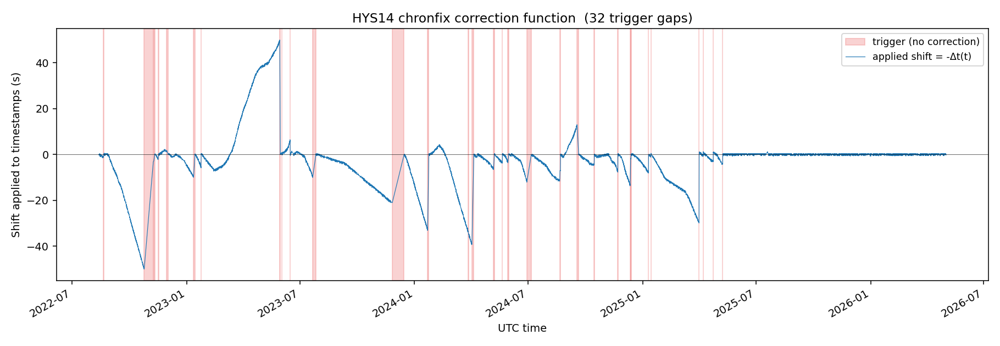
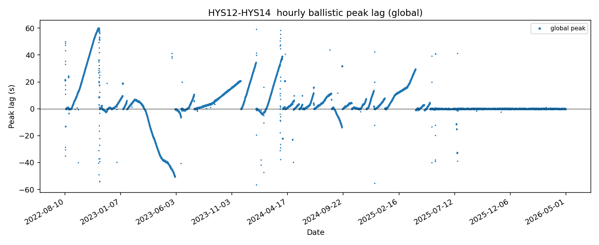
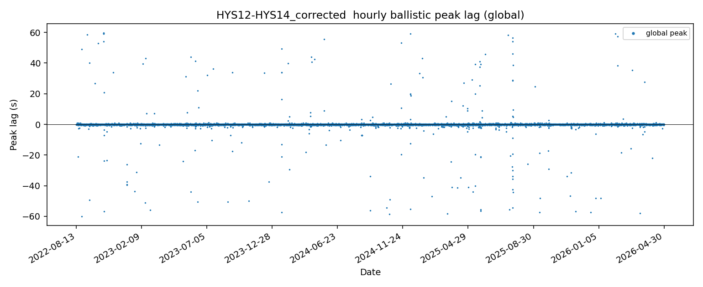
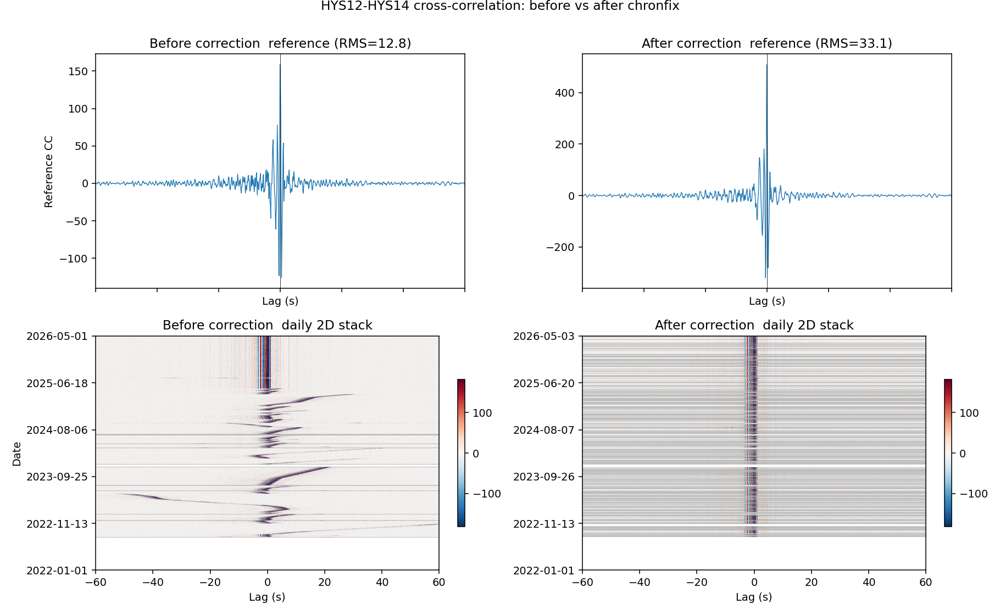

# chronfix

Apply chronos-measured timing corrections to MiniSEED data.

chronos measures the clock error Δt(t) of one station against a
reference station and writes a **correction file** (a directory of
NumPy arrays + CSV). chronfix consumes that correction file and
produces corrected MiniSEED, splitting the output at every trigger
boundary (real clock discontinuity).

This package does *not* depend on chronos at runtime — it just reads
the correction file format. The two are kept separate so chronfix can
be released as its own repository.

## Install

```bash
git clone https://github.com/<you>/chronfix.git
cd chronfix
pip install -e .
```

(Or unzip a downloaded archive instead of cloning.) The `-e` flag
installs in editable mode so source edits are picked up without a
reinstall; drop it for a regular install.

## Usage

A bundled HYS14 correction file is included under `examples/HYS14/`
for the OOI HYS14 fix. Use it like this:

```bash
python -m chronfix.scripts.apply_correction \
    --correction-dir examples/HYS14 \
    --network OO --station HYS14 --channel MHZ \
    --input-root  /path/to/raw/mseed/root \
    --output-root /path/to/corrected/mseed/root \
    --start 2022-08-13 --workers 8
```

For another station, point `--correction-dir` at any directory in the
chronos correction-file format (see below), and pass the matching
network / station / channel.

Outputs:
- One MiniSEED file per input day under
  `<output-root>/<station>/<yr>/<doy>/<station>.<network>.<yr>.<doy>.<channel>`,
  containing one record per stable segment overlap.
- A `<output-root>/<station>/manifest.csv` with one row per output
  segment (input path, output path, UTC bounds, sample count).

## Worked example: HYS14 (OOI Hydrate Ridge OBS)

The included `examples/HYS14/` is a real correction generated by
chronos for the OOI HYS14 OBS, whose clock drifted continuously and
was resynced 32 times across 2022-08 → 2026-05. Below is a tour of
what the correction does.

### 1 — The shift function chronfix applies

For every sample's apparent timestamp `t`, chronfix subtracts
`Δt(t)`, where Δt(t) is the linear interpolation of the cleaned
hourly Δt within stable segments. The cleaned hourly Δt is itself the
output of a per-segment robust smoother (rolling median + light moving
average) that removes per-sample lag-pick jitter without imposing a
functional form on the drift. Pink bands are trigger intervals (clock
discontinuities); chronfix splits the output mseed at each.



The shifted samples reach ±50 s during the worst drift episodes. After
the last resync, the clock is healthy and the function sits at zero.

### 2 — Hourly peak-lag track: before vs after

The validation diagnostic. Each dot is the lag of the ballistic peak
in one hour's HYS12-HYS14 cross-correlation. Before correction it
tracks the HYS14 clock drift exactly; after correction it sits at
zero across the full record.

| Before correction | After correction |
|---|---|
|  |  |

Sparse off-trend dots in the "after" plot are noise-driven picks at
low-SNR hours (uniformly scattered, no time structure) — not residual
clock error.

### 3 — Cross-correlation: before vs after

The same cross-correlations stacked into a long-term reference (top
row) and a daily 2D plot (bottom row). Reference RMS rises from 12.8
to 40.6 (≈ 3.2× stronger) because each daily CCF is now coherently
aligned at lag 0 instead of smearing across ±50 s.



The drift bands wandering across the bottom-left panel collapse onto
a single tight vertical stripe at lag 0 in the bottom-right.

## Correction-file format

The correction directory must contain:

| File | dtype | meaning |
|---|---|---|
| `delta_t_hourly_clean.npy` | float64 | Cleaned hourly Δt (s); NaN where masked |
| `hour_times.npy` | datetime64[h] | Master hour axis aligned with `delta_t_hourly_clean` |
| `trigger_periods.csv` | — | Merged trigger intervals; needs `start_index`, `end_index` |

This is exactly what `chronos.scripts.filter_and_triggers` writes.

## Public API

```python
from chronfix import ClockModel, correct_trace, correct_stream

model = ClockModel.from_chronos("/path/to/clock_estimate/HYS14")
corrected_traces = correct_trace(tr, model, method="resample")  # list[Trace]
corrected_stream = correct_stream(st, model, method="resample") # Stream
```

`method="resample"` (default) interpolates the trace data onto a
regular UTC grid. `method="shift_only"` is bit-identical-data lossless
but only valid when within-segment drift is negligible.

## Layout

```
chronfix/
├── README.md
├── pyproject.toml
├── src/chronfix/
│   ├── __init__.py
│   ├── clock_model.py             ClockModel: load + query correction file
│   ├── correct.py                 correct_trace / correct_stream
│   └── scripts/
│       └── apply_correction.py    CLI driver
├── examples/
│   └── HYS14/                     bundled correction file + figures
└── tests/
```

## Uncertainty of the correction

The corrected timestamp at any sample is `t_corr = t − Δt(t)`. The
uncertainty on `Δt(t)` — and therefore on `t_corr` — comes from three
sources, only two of which contribute under the actual chronfix method:

| source | scale (HYS14) | included in σ_total? |
|---|---|---|
| σ_lag — CCF peak-lag pick uncertainty (parabolic fit to envelope-of-CC², propagated from off-peak noise) | ≈ 2 ms (median), 5 ms (p90) | yes |
| σ_model — per-segment scatter of raw cleaned Δt vs the deployed smoothed model (robust MAD per inter-trigger segment) | ≈ 0.077 s (median), 0.108 s (p90) | yes |
| σ_nonlin — deviation from a whole-segment linear fit | ≈ 0.3 s (median), 2.7 s (p90) | **no** — see below |

**Reported uncertainty for the chronfix correction:**

> **σ_total ≈ 0.08 s typical, ≈ 0.11 s at the 90th percentile**, with a
> worst-case ≈ 0.17 s on a single long curved segment. Dominated by the
> 0.125 s lag-pick sample interval (one sample at fs = 8 Hz, RMS
> quantization floor 0.125/√12 ≈ 0.036 s) propagated through the per-segment
> smoother. End-effects within ~½ smoother window (~12 h) of a trigger
> boundary can be slightly larger (~0.1 s transient), but stay below
> the same scale.

**Relative uncertainty.** Drift magnitudes on HYS14 reach ±50 s within
a single segment; the longest curved segment spans 56.7 s of total
drift. The 0.17 s worst-case σ on that segment is **≈ 0.3 %** of the
drift it is correcting. Across the full record, σ_total / |Δt| stays
in the sub-percent range whenever the correction is meaningfully
nonzero. The correction is small relative to the signal it removes,
not relative to the timing precision of any individual seismic
measurement.

### Why σ_nonlin is excluded

A linear-drift assumption *would* introduce a multi-second error
(σ_nonlin above) — drift segments are visibly curved. Chronfix does
not make that assumption. It linearly interpolates between hourly
samples of the **24 h rolling-median + 6 h moving-average** smoothed
Δt model, which tracks curvature on multi-hour timescales. The
interpolation error between two adjacent smoothed hourly samples is
bounded by the second derivative of the smoothed curve over a 1 h
step and is well below the 0.125 s sample interval, so it does not enter
σ_total.

The σ_nonlin number is reported anyway as a sanity check on what a
worse method (whole-segment linear fit) would produce, and to flag
that the choice of "what time you apply a measured drift to" does
matter — but only if you measure drift over a long window and don't
track curvature within it.

### How σ_total is computed

The diagnostic script lives in the chronos package
(`chronos/scripts/uncertainty.py`) and writes:

```
data/uncertainty/<station>/
    sigma_lag_hourly.npy
    sigma_model_hourly.npy
    sigma_nonlin_hourly.npy   # reference only, not in total
    sigma_total_hourly.npy    # √(σ_lag² + σ_model²)
    segment_summary.csv
    uncertainty.png
```

For the HYS14 worked example, the per-segment residual (raw cleaned Δt
minus modeled Δt) has median ≈ 0.000 s and MAD ≤ 0.115 s on every
inter-trigger segment, including the longest curved ramp (126 days /
56.7 s of total drift). No detectable timing signal remains in the
residuals — what is left is consistent with the 0.125 s lag-pick sample interval.

### Caveats

- **Higher sample-rate channels** (e.g. HHZ at 200 Hz) reuse the same
  Δt(t), but the 0.125 s lag-pick sample interval here was set by the 8 Hz analysis
  rate. Sub-0.125-s structure in true Δt is not resolved and is not
  reflected in σ_total.
- **Days where chronos has no Δt** (NaN after outlier filtering) are
  skipped entirely; they do not get a degraded correction with a
  larger σ. They get no correction.
- σ_total is a per-hour quantity. Within an hour, the same uncertainty
  applies to every sample (the smoothed model is interpolated linearly
  between hourly anchors).

## Across-trigger gaps and overlaps

A trigger interval is a real clock discontinuity. After correction:

- Δt **decreasing** at the trigger → corrected output has a UTC **gap**
  between the two segment files equal to the jump magnitude.
- Δt **increasing** at the trigger → corrected output has a UTC
  **overlap**.

These reflect the fact that the clock was wrong before the trigger and
the discontinuity is unavoidable. Downstream tools must handle both as
they would any other gap or duplicate.
